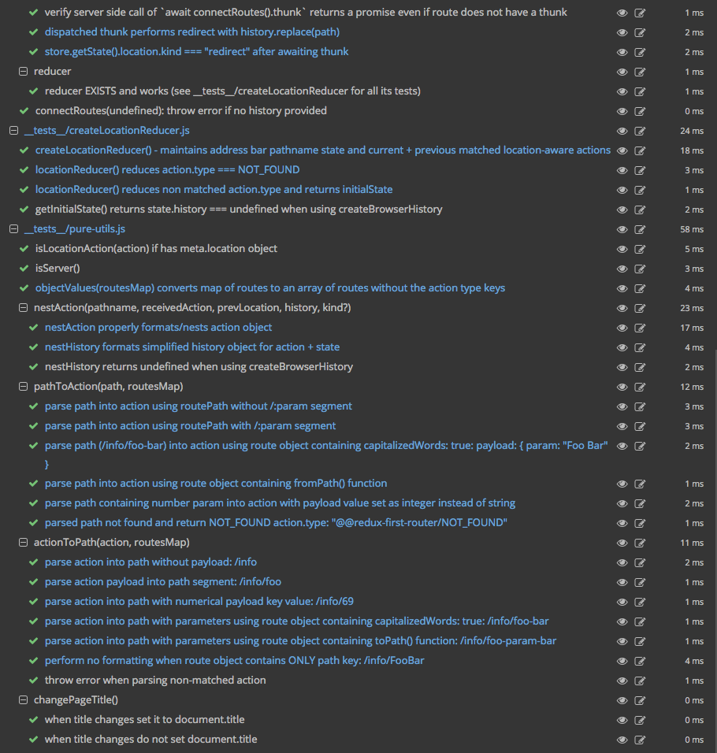

<a href="https://gitter.im/Reactlandia/Lobby" target="_blank">
  
</a>

<a href="https://codesandbox.io/s/github/faceyspacey/redux-first-router-codesandbox" target="_blank">
  
</a>

<a href="https://github.com/faceyspacey/redux-first-router-boilerplate" target="_blank">
  
</a>

<a href="https://github.com/faceyspacey/redux-first-router-demo" target="_blank">
  
</a>

> **UPDATE (8/15):** you can now add additional routes as part of your code splitting strategy. See [this issue comment](https://github.com/faceyspacey/redux-first-router/issues/62#issuecomment-322558836) for more info.

> **UPDATE (9/5):** you can now block user navigation via the `confirmLeave` route option (and customize its appearance via the `displayConfirmLeave` option). See [this issue comment](https://github.com/faceyspacey/redux-first-router/issues/27#issuecomment-327431413) for more info. Do `yarn upgrade redux-first-router@next` to get it.

# Redux-First Router

<p align="center">
  <a href="https://www.npmjs.com/package/redux-first-router">
    
  </a>

  <a href="https://travis-ci.org/faceyspacey/redux-first-router">
    
  </a>

  <a href="https://lima.codeclimate.com/github/faceyspacey/redux-first-router/coverage">
    
  </a>

  <a href="https://greenkeeper.io">
    
  </a>

  <a href="https://lima.codeclimate.com/github/faceyspacey/redux-first-router">
    
  </a>

  <a href="https://www.npmjs.com/package/redux-first-router">
    
  </a>
  
  <a href="https://snyk.io/test/github/faceyspacey/redux-first-router">
    
  </a>

  <a href="https://www.npmjs.com/package/redux-first-router">
    
  </a>
</p>


The goal of **Redux-First Router** is to think of your app in *states*, not *routes*, not *components*, while keeping the address bar in sync. Everthing is state, not components. Connect your components and *just dispatch* ***flux standard actions.***

**Articles You Should Read:**
- **[Pre Release: Redux-First Router — A Step Beyond Redux-Little-Router](https://medium.com/@faceyspacey/pre-release-redux-first-router-a-step-beyond-redux-little-router-cd2716576aea)** 
- **[Redux-First Router lookin Sexy on Code Sandbox](https://medium.com/faceyspacey/redux-first-router-lookin-sexy-on-code-sandbox-d9d9bea15053)** 
- **[Redux-First Router data-fetching: solving the 80% use case for async Middleware](https://medium.com/faceyspacey/redux-first-router-data-fetching-solving-the-80-use-case-for-async-middleware-14529606c262)**
- **[Server-Render like a Pro /w Redux-First Router in 10 steps](https://medium.com/faceyspacey/server-render-like-a-pro-w-redux-first-router-in-10-steps-b27dd93859de)** 🚀🚀🚀 *(READ THIS!)*

The thinking behind this package has been: "if we were to dream up a 'Redux-first' approach to routing from the 
ground up, what would it look like?" The result has been what we hope you feel to be one of those 
"inversion of control" scenarios that makes a challenging problem *simple* when coming at it from a different angle.
We hope *Redux-First Router* comes off as an obvious solution.

Before we get started, there is some *prior art*, and you should [check them out](./docs/prior-art.md). **Redux-First Router**
isn't the first stab at something like this, but--aside from this path being pre-validated--we feel it is the most complete, tested and *spot on* solution.
We have reviewed what came before, stripped what was unnecessary, added what was needed, and generally focused on getting the ***developer experience*** right. Ultimately it offers far more than previous solutions. The best
part is that once you set it up there's virtually nothing left to do. It's truly "set it and forget it." Let's get started.

> And did we mention: **it has first class support for** ***React Navigation!***

## Installation

Install `redux-first-router` and its peer dependency `history` plus our small `<Link />` package:

```bash
yarn add history redux-first-router redux-first-router-link
```

**Full-Featured Universal Demo App (includes SSR + Splitting!):**

https://github.com/faceyspacey/redux-first-router-demo


## Motivation - What Routing in Redux is Meant To Be

To automate routing. To be able to use Redux *as is* while keeping the URL in the address bar in sync. 
To think solely in terms of *"state"* and *NOT routes, paths, route matching components*. And of course
for server side rendering to require no more than dispatching on the store like normal. *Path params are just
action payloads, and action types demarcate a certain kind of path*. **That is what routing in Redux is meant to be.** 

In practice, what that means is having the address bar update in response to actions and ***bi-directionally*** 
having actions dispatched in response to address bar changes, such as via the browser
back/forward buttons. The "bi-directional" aspect is embodied in the diagram above where the first blue arrows
points both ways--i.e. dispatching actions changes the address bar, *and* changes to
the address bar dispatches actions.

In addition, here are some key obstacles **Redux-First Router** seeks to *avoid*:

* having to render from any state that doesn't come from redux
* cluttering component code with route-related components
* the added complexity [and bugs] from 2 forms of state: redux state vs. routing state
* large API surface areas  of packages/frameworks
like `react-router` and `next.js`
* workarounds that such large *(likely "leaky")* abstractions inevitably require to achieve a professional app
* strategies as low level as possible to deal with animations. Animations coinciding with React 
component updates *are* a problem, particularly in the browser (React Native is better). 
"Jank" is common. Techniques  like `shouldComponentUpdate` are a must; routing frameworks 
get in the way of optimizing animations.


## The Gist
It's *set-and-forget-it*, so here's the most work you'll ever do! :+1:
```javascript
import { connectRoutes } from 'redux-first-router'
import { combineReducers, createStore, applyMiddleware, compose } from 'redux'
import createHistory from 'history/createBrowserHistory'
import userIdReducer from './reducers/userIdReducer'

const history = createHistory()

// THE WORK:
const routesMap = { 
  HOME: '/home',      // action <-> url path
  USER: '/user/:id',  // :id is a dynamic segment
}

const { reducer, middleware, enhancer } = connectRoutes(history, routesMap) // yes, 3 redux aspects

// and you already know how the story ends:
const rootReducer = combineReducers({ location: reducer, userId: userIdReducer })
const middlewares = applyMiddleware(middleware)
// note the order: enhancer, then middlewares
const store = createStore(rootReducer, compose(enhancer, middlewares))
```

```javascript
import { NOT_FOUND } from 'redux-first-router'

export const userIdReducer = (state = null, action = {}) => {
  switch(action.type) {
    case 'HOME':
    case NOT_FOUND:
      return null
    case 'USER':
      return action.payload.id
    default: 
      return state
  }
}
```

And here's how you'd embed SEO/Redux-friendly links in your app, while making use of the triggered state:
```javascript
import React from 'react'
import ReactDOM from 'react-dom'
import { Provider, connect } from 'react-redux'
import Link from 'redux-first-router-link'
import store from './configureStore'

const App = ({ userId, onClick }) =>
  <div>
    {!userId  
      ? <div>
          <h1>HOME</h1>

          // all 3 "links" dispatch actions:
          <Link to="/user/123">User 123</Link> // action updates location state + changes address bar
          <Link to={{ type: 'USER', payload: { id: 456 } }}>User 456</Link> // so does this
          <span onClick={onClick}>User 5</span>   // so does this, but without SEO benefits
        </div>

      : <h1>USER: {userId}</h1> // press the browser BACK button to go HOME :)
    }
  </div>

const mapStateToProps = ({ userId }) => ({ userId })
const mapDispatchToProps = (dispatch) => ({
  onClick: () => dispatch({ type: 'USER', payload: { id: 5 } })
})

const AppContainer = connect(mapStateToProps, mapDispatchToProps)(App)

ReactDOM.render(
  <Provider store={store}>
    <AppContainer />
  </Provider>,
  document.getElementById('react-root')
)
```
*note: ALL THREE clickable elements/links above will change the address bar while dispatching the corresponding `USER` action. The only difference
is the last one won't get the benefits of SEO--i.e. an `<a>` tag with a matching `to` path won't be embedded in the page.* ***What this means is
you can take an existing Redux app that dispatches similar actions and get the benefit of syncing your address bar without changing your code!*** *The workflow we recommend is to
first do that and then, once you're comfortable, to use our `<Link />` component to indicate your intentions to Google. Lastly, we recommend
using `actions` as your `to` prop since it doesn't marry you to a given URL structure--you can always change it in one place later (the `routesMap` object)!*

Based on the above `routesMap` the following actions will be dispatched when the
corresponding URL is visited, and conversely those URLs will appear in the address bar
when actions with the matching `type` and parameters are provided
as keys in the payload object:

| URL                | <-> | ACTION     |
| ------------------ |:---:| ----------:|
| /home              | <-> | { type: 'HOME' } |
| /user/123          | <-> | { type: 'USER', payload: { id: 123 } } |
| /user/456          | <-> | { type: 'USER', payload: { id: 456 } } |
| /user/5            | <-> | { type: 'USER', payload: { id: 5 } } |

*note: if you have more keys in your payload that is fine--so long as you have the minimum required keys to populate the path*

Lastly, we haven't mentioned `redux-first-router-link`yet--**Redux-First Router** is purposely built in
a very modular way, which is why the `<Link />` component is in a separate package. It's extremely simple
and you're free to make your own. Basically it passes the `to` path on to **Redux-First Router** and calls
`event.preventDefault()` to stop page reloads. It also can take an action object as a prop, which it will transform
into a URL for you! Its props API mirrors React Router's. The package is obvious enough once you get the hang of what's going on here--check it
out when you're ready: [redux-first-router-link](http://github.com/faceyspacey/redux-first-router-link). And if 
you're wondering, yes there is a `NavLink` component with props like `activeClass` and `activeStyle` just like in React Router.

## routesMap

The `routesMap` object allows you to match action types to express style dynamic paths, with a few frills.
Here's the primary (and very minimal *easy to remember*) set of configuration options available to you:

```javascript
const routesMap = {
  HOME: '/home', // plain path strings or route objects can be used
  CATEGORY: { path: '/category/:cat', capitalizedWords: true },
  USER: { 
    path: '/user/:cat/:name',
    fromPath: path => capitalizeWords(path.replace(/-/g, ' ')),
    toPath: value => value.toLowerCase().replace(/ /g, '-'),
  },
}
```
*note: the signature of `fromPath` and `toPath` offers a little more, e.g: `(pathSegment, key) => value`. Visit [routesMap docs](./docs/connectRoutes.md#routesmap) for a bit more info when the time comes.*

| URL                     | <-> | ACTION     |
| ----------------------- |:---:| ----------:|
| /home                   | <-> | { type: 'HOME' } |
| /category/java-script   | <-> | { type: 'CATEGORY', payload: { cat: 'Java Script' } } |
| /user/elm/evan-czaplicki   | <-> | { type: 'USER', payload: { cat: 'ELM', name: 'Evan Czaplicki' } } |


## routesMap (with thunk)
We left out one final configuration key available to you: *a thunk*.
After the dispatch of a matching action, a thunk (if provided) will be called, allowing you to extract path parameters from the location reducer state and make asyncronous requests to get needed data:

```javascript
const userThunk = async (dispatch, getState) => {
  const { slug } = getState().location.payload
  const data = await fetch(`/api/user/${slug}`)
  const user = await data.json()
  const action = { type: 'USER_FOUND', payload: { user } }
  
  dispatch(action)
}

const routesMap = {
  USER: { path: '/user/:slug', thunk: userThunk  },
}
```

> your `thunk` should return a promise for SSR to be able to `await` for its resolution and for `updateScroll()` to be called if using our [scroll restoration package](https://github.com/faceyspacey/redux-first-router-restore-scroll).

*note: visit the [location reducer docs](./docs/locationReducer) to see the `location` state's shape*

| URL                     | <-> | ACTION     |
| ----------------------- |:---:| ----------:|
| /user/steve-jobs        | <-> | { type: 'USER', payload: { slug: 'steve-jobs' } } |
| n/a                     | n/a | { type: 'USER_FOUND', payload: { user: { name: 'Steve Jobs', slug: 'steve-jobs' } } } |

That's all folks! :+1:


## More Docs (they are short easy reads) 
* [connectRoutes (there is a third `options` parameter you should check out)](./docs/connectRoutes.md)
* [action.meta (the `meta` key is how our system communicates & how our action maintains its status as an "FSA")](./docs/action.md)
* [location reducer shape](./docs/reducer.md)
* [server side rendering](./docs/server-rendering.md)
* [query strings](./docs/query-strings.md)
* [scroll restoration](./docs/scroll-restoration.md)
* [redirects](./docs/server-rendering.md#redirects-example)
* [client-only API](./docs/client-only-api.md)
* [React Native](./docs/react-native.md)
* [React Navigation Support](./docs/react-native.md#first-class-react-navigation-support) 🔮  - *my current primary day-to-day focus*
* [Prefetching!](./docs/prefetching.md) 🔮 - `<Link prefetch />` ***powered by:*** **[react-universal-component](https://github.com/faceyspacey/react-universal-component)** + **[webpack-flush-chunks](https://github.com/faceyspacey/webpack-flush-chunks)**
## FAQ

What about if the URL is not found?
> If the path is not found, or if actions fail to be converted to paths, our `NOT_FOUND` action type will be dispatched. You can apply it
as a case in your reducer's switch statements. Here's where you get it: `import { NOT_FOUND } from 'redux-first-router'`. We have strong
idiomatic way to deal with it in server side rendering--check it out: [server side rendering](./docs/server-rendering.md).

What if I don't want to use the *thunk* feature, can I use other ways of requesting the data?
> Of course. This work along side any middleware of your choosing, and even GraphQL solutions like Apollo. But for the 80% use-case, "follow-up" thunks attached to routes gets a lot of bang for your buck via the context associated with the initial route action.

Ok, but what if I request my data in `componentDidMount`?
>This works great for that, but it's a naive strategy without a server-side recursive promise resolution service like Apollo offers. The problem with `componentDidMount` is that you can't generate all
the state required to render your app without first rendering your app at least once. That means additional work on your part as well as cycles
on the server (the latter of which is also a caveat for Apollo). It's also makes Redux's highly useful time-traveling tools *unreliable*. If that's where you're at in how you get things
done, that's fine--but we recommend leveling up to a "dispatch to get state" strategy (rather than a "get state on render" approach), as that will provide way more predictability, which is
especially useful when it comes to testing. When it comes to server side rendering there is no better option. We recommend looking at our 
[server side rendering doc](./docs/server-rendering.md) to see the
recommended approach.

The middleware dispatches thunks asyncronously with no way for me to *await* them, how can I wait for asyncronously received data on the server?
> Please visit the [server side rendering doc](./docs/server-rendering.md). In short,
thunks are not dispatched from the middleware on the server, but `connectRoutes`, returns a `thunk` in addition to `middleware`, `enhancer` and `reducer`,
which you can await on, and it will retreive any data corresponding to the current route! We think our solution is slick and sensible.

The server has no `window` or `history`, how can I get that on the server?
> The [history](https://github.com/ReactTraining/history) package provides a `createMemoryHistory()` function just for this scenario.
It essentially generates a fake `history` object based on the `request.path` *express* (or similar packages) will give you. It's painless. Check it out!

Does this work with React Native?
> Yes, just like server side rendering, you can use the `history` package's `createMemoryHistory()` function. It's perfect for React Native's `Linking` API and push notifications in general. In fact, 
if you built your React Native app already and are just starting to deal with deep-linking and push notifications, **Redux-First Router**
is perfectly suited to be tacked on in final stages with very few changes. We also have first-class support for [**React Navigation**](./docs/react-native.md#first-class-react-navigation-support), which really is the crown jewel here and where we do most our work these days. It does some amazing things. [Check it out!](./docs/react-native.md#first-class-react-navigation-support)

Ok, but there's gotta be a catch--what changes should I expect to make if I start using **Redux-First Router**?
> Primarily it will force you to consolidate the actions you use in your reducers. Whereas before you might have had
several actions to trigger the same state, you will now centralize on a smaller number of actions that each correspond 
to a specific URL path. Your actions will become more "page-like", i.e. geared towards triggering page/URL transitions. 
That said, you absolutely don't need to have a URL for every action. In our apps, we don't. Just the actions that lead
to the biggest visual changes in the page that we want search engines to pick up.

And what about actually getting links on the page for search engines to see?
> Use [redux-first-router-link](http://github.com/faceyspacey/redux-first-router-link). This package has been built in a modular way,
which is why that's not in here. *redux-first-router-link's* `<Link />` and `<NavLink />` components mirror React Router's. You should be using these on web to get `<a>` tags on your page for *Google*. In React Native, just dispatch actions in `onPress` handlers.

Why no route matching components like *React Router*?
> Because they are unnecessary when the combination of actions and reducers lead to both a wider variety and better defined set of states, not to mention
more singular. By "singular" we mean that you don't have to think in terms of *both* redux state *AND* address bar paths. You just think
in terms of *state* after you setup your routes map. It makes your life simpler. It makes your code cleaner and easier to understand. It gives you the best control
React + Redux has to offer when it comes to optimizing rendering for animations. 

What about all the code splitting features *Next.js* has to offer?
> They certainly crush it when it comes to code splitting. There's no doubt about it. But check out their Redux example
where it seems to have a different `store` per page. I've asked, and they do merge, but it complicates how you will use Redux. If your app is 
very page-like, great--but we think the whole purpose of tools like React and Redux is to build *"apps"* not *pages*. 
The hallmark of an app is seamless animated transitions where you forget you're on a specific page. You need full
control of rendering to do that at the highest level. `shouldComponentUpdate`, pure functions and [reselect](https://github.com/reactjs/reselect)
become your best friends. Everything else gets in the way. And of course **Redux-First Router** stays out of the way.
Straightup, let us know if you think we nailed it or what we're missing. Feel free to use github issues.

Gee, I've never seen a Redux middleware/enhancer tool return so many things to use for configuring the store???
>Part of what **Redux-First Router** does so well (and one of its considerations from the start) is server side rendering. All these
aspects depend on state unique to each visit/request. The returned `middleware`, `enhancer`, `reducer` and `thunk` functions share
enclosed state (i.e. within a "closure") in a *per instance* fashion. Most of the code is written as pure utility functions
and we are very proud about that. But what's not is returned to you in a way that will insure state is not shared between
requests on the server. In short, we have spared no expense to get this package as tight as possible. Watch the video below to get an 
idea of how the system works and its overall simplicity:

*video coming soon...*


## Contributing


We use [commitizen](https://github.com/commitizen/cz-cli), so run `npm run cm` to make commits. A command-line form will appear, requiring you answer a few questions to automatically produce a nicely formatted commit. Releases, semantic version numbers, tags, changelogs and publishing to NPM will automatically be handled based on these commits thanks to [semantic-release](https://github.com/semantic-release/semantic-release). Be good.


## Tests

Reviewing a package's tests are a great way to get familiar with it. It's direct insight into the capabilities of the given package (if the tests are thorough). What's even better is a screenshot of the tests neatly organized and grouped (you know the whole "a picture says a thousand words" thing). 

Below is a screenshot of this module's tests running in [Wallaby](https://wallabyjs.com) *("An Integrated Continuous Testing Tool for JavaScript")* which everyone in the React community should be using. It's fantastic and has taken my entire workflow to the next level. It re-runs your tests on every change along with comprehensive logging, bi-directional linking to your IDE, in-line code coverage indicators, **and even snapshot comparisons + updates for Jest!** I requestsed that feature by the way :). It's basically a substitute for live-coding that inspires you to test along your journey.




## More from FaceySpacey in Reactlandia
- [react-universal-component](https://github.com/faceyspacey/react-universal-component). It's made to work perfectly with *Redux First Router*. Together they comprise our *"frameworkless"* Redux-based approach to what Next.js does (splitting, SSR, prefetching, and routing).
- [webpack-flush-chunks](https://github.com/faceyspacey/webpack-flush-chunks). And this is the foundation of our `Universal` product line. Make sure to check out!

