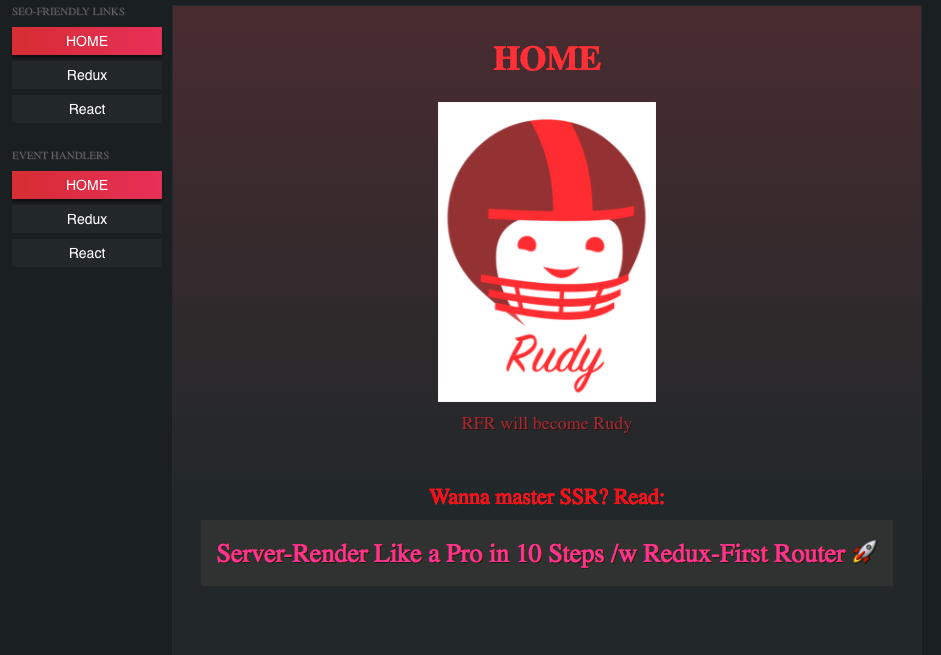

<a href="https://codesandbox.io/s/github/faceyspacey/redux-first-router-codesandbox" target="_blank">
  
</a>


# Simple Universal Boilerplate of [Redux-First Router](https://github.com/faceyspacey/redux-first-router)



> For a demo/boilerplate that goes even farther make sure to check out the **["DEMO"](https://github.com/faceyspacey/redux-first-router-demo)**. A lot more features and use-cases are covered there, but this *boilerplate* is the best place to start to learn the basics of RFR, especially if you're new to any of these things: SSR, Code Splitting, Express, APIs, Webpack and Redux in general.


## Installation

```
git clone https://github.com/faceyspacey/redux-first-router-boilerplate
cd redux-first-router-boilerplate
yarn
yarn start
```


## Files You Should Look At:

*client code:*
- [***src/configureStore.js***](./src/configureStore.js)
- [***src/routesMap.js***](./src/routesMap.js) - ***(the primary work of RFR)***
- [***src/components/Switcher.js***](./src/components/Switcher.js) - *(universal component concept)*
- [***src/components/Sidebar.js***](./src/components/Sidebar.js) - *(look at the different ways to link + dispatch URL-aware actions)*


*server code:*
- [***server/index.js***](./server/index.js)
- [***server/render.js***](./server/render.js) - *(super simple thanks to [webpack-flush-chunks](https://github.com/faceyspacey/webpack-flush-chunks) from our ***"Universal"*** product line)*
- [***server/configureStore.js***](./server/configureStore.js) - ***(observe how the matched route's thunk is awaited on)***


